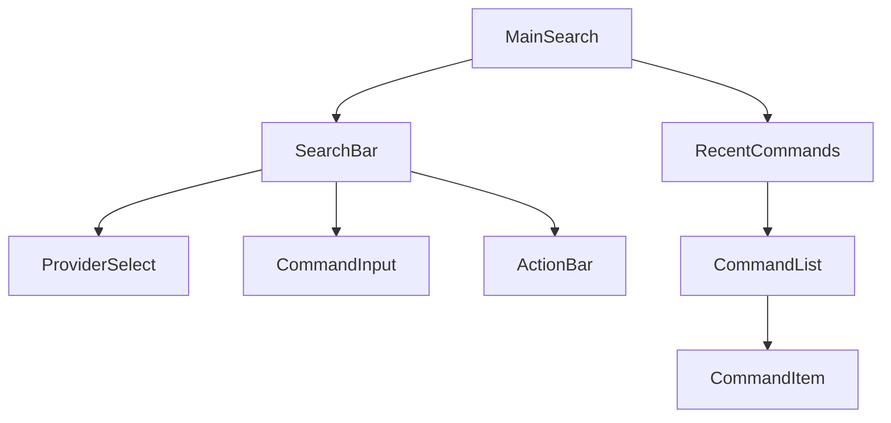
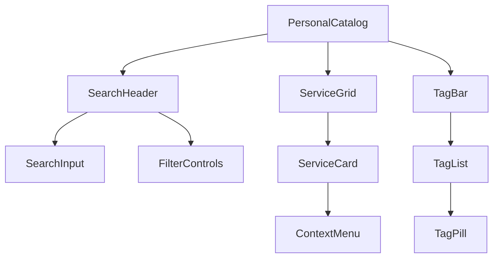
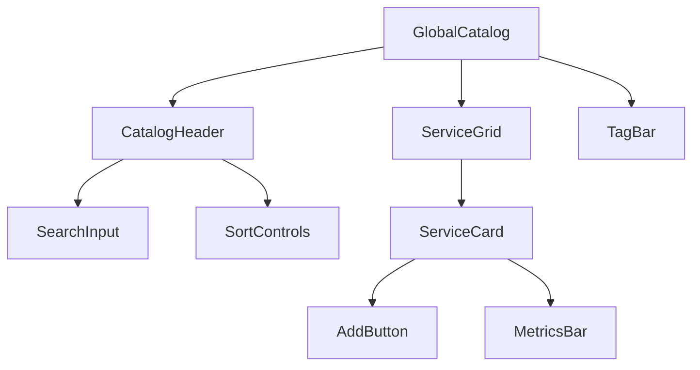

# Component Architecture

## Page Components

### MainSearch.tsx (/)

Components:

- `SearchBar` - Main command input container
  - `ProviderSelect` - Search engine dropdown
  - `CommandInput` - Command parsing & suggestions
  - `ActionBar` - Execute/clear/settings
- `RecentCommands` - Command history
  - `CommandList` - Virtual list of recent commands
  - `CommandItem` - Individual command with metadata

### PersonalCatalog.tsx (/personal)

Components:

- `SearchHeader` - Search and filtering
  - `SearchInput` - Full-text search
  - `FilterControls` - Tag/sort controls
- `ServiceGrid` - Virtual grid of services
  - `ServiceCard` - Service with metadata
  - `ContextMenu` - Service actions
- `TagBar` - Tag navigation
  - `TagList` - Horizontal virtual list
  - `TagPill` - Individual tag with count

### GlobalCatalog.tsx (/catalog)

Components:

- `CatalogHeader` - Global search
  - `SearchInput` - Service search
  - `SortControls` - Popularity/recent
- `ServiceGrid` - Infinite loading grid
  - `ServiceCard` - Service preview
    - `AddButton` - Add to personal
    - `MetricsBar` - Usage stats
- `TagBar` - Category navigation

## Shared Components

### Data Display

- `VirtualGrid` - Windowed grid renderer
- `VirtualList` - Windowed list renderer
- `InfiniteLoader` - Load more trigger

### Inputs

- `CommandParser` - Command tokenization
- `Typeahead` - Real-time suggestions
- `SearchInput` - Full-text search

### UI Elements

- `IconButton` - Action buttons
- `DropdownMenu` - Context menus
- `Toast` - Status notifications

## Component State

### Local State

- Form inputs
- UI interactions
- Animation states

### Global State

- Search queries
- Selected services
- Active tags
- Command history

## Related Documentation

- [[../components/index|UI Components Overview]]
- [[../components/SearchBar|SearchBar Component]]
- [[../components/ServiceGrid|ServiceGrid Component]]
- [[../components/TagBar|TagBar Component]]
- [[../components/CommandBuilder|CommandBuilder Component]]
- [[pages|Page Structure]] 
