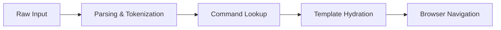
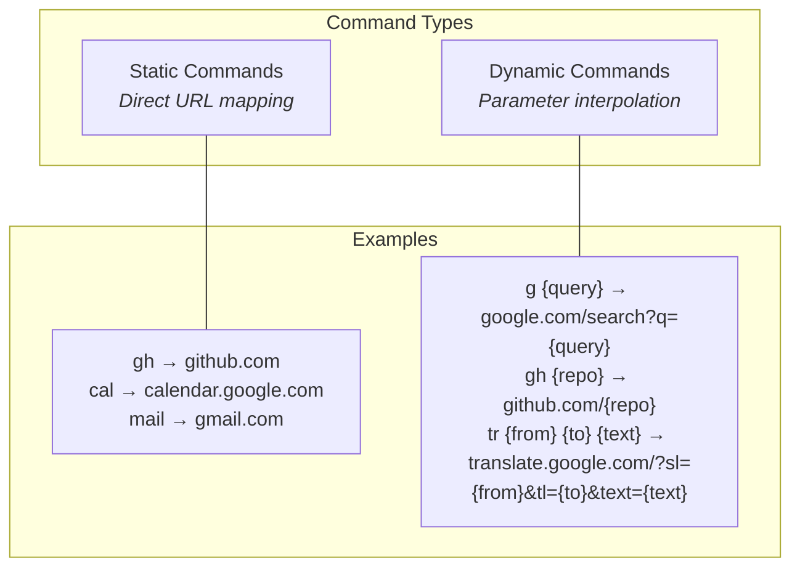
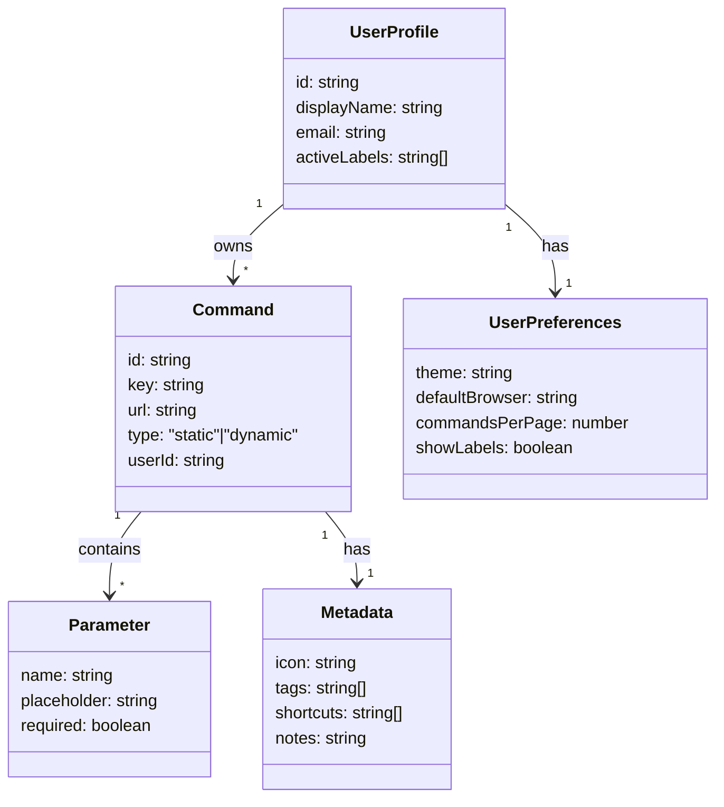
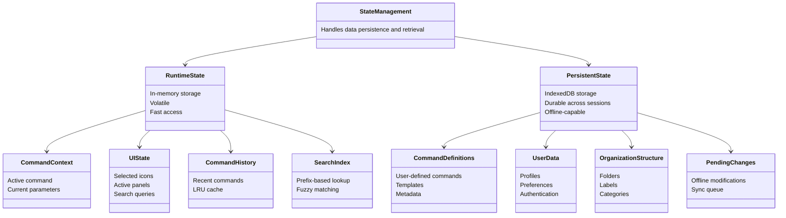
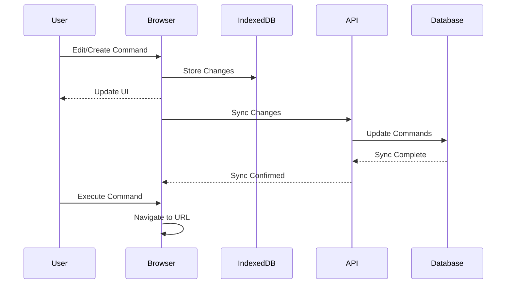
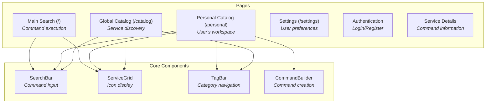
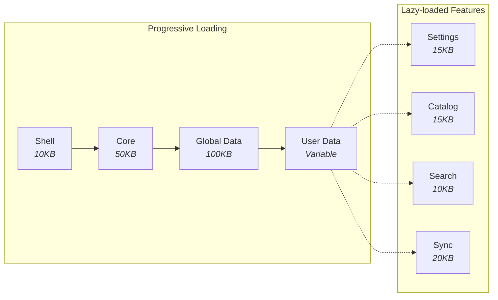
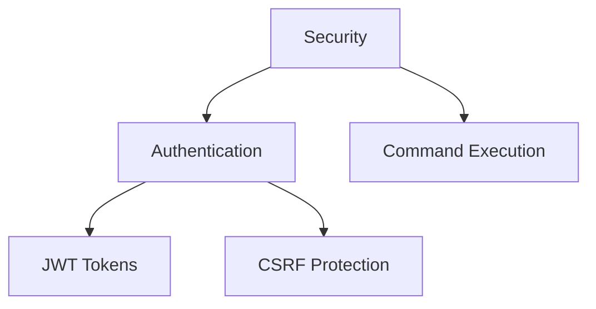

# Technical Architecture

## 1. System Overview

meows.space transforms text inputs into parameterized URLs. The system operates as a command multiplexer with URL routing and command history management.

## 2. Core Architecture

### 2.1 Command System

The command system forms the core of meows.space, transforming user text inputs into parameterized URLs through a structured pipeline. It processes raw text commands, identifies command patterns, extracts parameters, and constructs destination URLs based on predefined templates. This system enables users to quickly navigate to web destinations using shorthand commands rather than typing full URLs.

#### Command Processing Pipeline



The pipeline processes commands through these stages:

1. Input parsing and tokenization - Breaks down raw input into tokens
2. Command lookup and parameter extraction - Matches tokens to commands
3. URL template hydration - Populates templates with parameters
4. Browser navigation - Performs the navigation operation

#### Command Types



The system supports two fundamental command types:

**Static Commands** provide direct URL mappings without parameters. They function as simple shortcuts to frequently visited websites. When a user enters a static command like `gh`, the system immediately navigates to the associated URL (`github.com`) without requiring additional input. These commands are ideal for quick access to common destinations.

**Dynamic Commands** incorporate parameters into URL templates. They accept one or more arguments that are interpolated into predefined URL patterns. For example, when a user enters `g cats`, the system recognizes `g` as the command and `cats` as the parameter, then constructs the URL `google.com/search?q=cats`. Dynamic commands can support multiple parameters with different positions in the URL template, enabling complex operations like translation services that require source language, target language, and text parameters.

#### Data Model



The system uses several interconnected data structures:

##### Command Model

```typescript
// Command definition
interface Command {
  id: string; // Unique identifier
  key: string; // Command invocation key
  url: string; // Target URL or template
  type: "static" | "dynamic"; // Execution model
  params?: Parameter[]; // For dynamic commands
  metadata: Metadata; // Extended properties
  folder?: string; // Organizational structure
  createdAt: Date; // Creation timestamp
  updatedAt: Date; // Last update timestamp
  userId: string; // Owner identifier
}
```

##### Parameter Model

```typescript
// Parameter definition for dynamic commands
interface Parameter {
  name: string; // Parameter identifier
  placeholder: string; // User-facing hint
  required: boolean; // Parameter requirement
}
```

##### Metadata Model

```typescript
// Command metadata
interface Metadata {
  icon?: string; // Visual identifier
  tags?: string[]; // Categorization
  shortcuts?: string[]; // Keyboard bindings
  notes?: string; // Documentation
}
```

##### User Profile Model

```typescript
// User profile
interface UserProfile {
  id: string; // User identifier
  displayName: string; // User display name
  email: string; // User email
  preferences: UserPreferences; // User settings
  activeLabels: string[]; // Currently active labels
  createdAt: Date; // Account creation date
  lastLogin: Date; // Last login timestamp
}
```

##### User Preferences Model

```typescript
// User preferences
interface UserPreferences {
  theme: "light" | "dark" | "system"; // UI theme
  defaultBrowser: string; // Default browser for commands
  commandsPerPage: number; // Display density
  showLabels: boolean; // Label visibility
  autoSync: boolean; // Automatic synchronization
  defaultFolder: string; // Default folder for new commands
}
```

### 2.2 State Management



The state management system handles data persistence and retrieval across different storage layers. It maintains application state during runtime and across sessions.

#### State Architecture

The state architecture consists of two primary components: runtime state in memory and persistent state in IndexedDB. Runtime state provides fast access to frequently used data, while persistent state ensures data durability across sessions.

#### Runtime State (Memory)

Runtime state contains the active application context during a session:

Command context maintains the currently active command and its parameters. This includes the command being edited or executed, along with any extracted parameters.

UI state tracks the current interface configuration, including selected commands, active panels, search queries, and scroll positions.

Command history keeps a record of recently executed commands in an LRU cache, enabling quick access to frequently used commands without database queries.

Search index provides an in-memory structure for fast command lookup, using prefix-based searching and fuzzy matching algorithms.

#### Persistent State (IndexedDB)

Persistent state maintains durable data across browser sessions:

Command definitions store all user-defined commands, including their URLs, parameters, and metadata. This forms the core of the user's command library.

User profiles contain user information, including display name, email, and authentication details.

User preferences store interface settings, default behaviors, and personalization options that persist across sessions.

Command history maintains a comprehensive log of executed commands with timestamps and execution contexts.

Organization structure stores the folder hierarchy, labels, and categorization system for commands.

Pending changes queue modifications made while offline, ensuring they're synchronized when connectivity is restored.

### 2.3 Data Synchronization

#### State Synchronization

The data synchronization system manages bidirectional data flow between client and server databases. It handles two primary processes:

Command Management Synchronization uses a transaction-based approach. When users modify commands, the system first applies changes to the local IndexedDB, then queues them for server synchronization. Each change is timestamped and assigned a unique transaction ID. When online, the system transmits these changes to the server in batches. For concurrent edits from multiple devices, the system applies last-writer-wins conflict resolution, with special handling for structural conflicts like command deletion followed by modification.

Command Execution records command usage statistics. When a user executes a command, the system logs this event locally and, when online, transmits usage data to the server for analytics. The browser handles the actual URL navigation after command processing.

#### System Flow



This diagram shows the data flow during command management and execution. Command edits are immediately stored in IndexedDB and reflected in the UI. When online, changes are synchronized with the server. For command execution, the browser constructs the URL and performs navigation directly.

## 3. Frontend Architecture

### 3.1 User Interface



The user interface of meows.space is structured around a set of core pages and components that provide command management, execution, and discovery capabilities. The system implements a Windows 95-inspired visual design with icon grids, categorization tools, and command input mechanisms.

#### Page Structure

The application consists of several key pages, each serving a specific purpose in the user experience:

**Main Search (/)** serves as the landing page and primary command execution interface. It provides immediate access to the command input field, which automatically receives focus when the page loads. The page displays a grid of command icons sorted by popularity, with category filters below the search input. For first-time visitors, this page shows popular global commands, while returning users see their personal command collection.

**Personal Catalog (/personal)** functions as the user's workspace for managing their command collection. It includes:

- SearchHeader with full-text search and filtering controls
- ServiceGrid displaying the user's commands as icons
- TagBar for category-based navigation
- Command editing capabilities

**Global Catalog (/catalog)** enables service discovery through:

- CatalogHeader with search and sorting options
- ServiceGrid showing community-created commands
- Usage statistics and popularity metrics
- Add buttons for importing commands to personal catalog

**Settings (/settings)** provides access to user preferences including:

- Search provider defaults
- UI theme settings
- Tag management
- Display density controls

**Authentication (/auth/login, /auth/register)** handles user account management with:

- Email/password authentication
- OAuth providers (GitHub, Google)
- Account creation and verification

**Service Details (/service/[id])** shows detailed information about a specific command:

- Service metadata and description
- Usage statistics
- Related commands
- Editing interface (for owned commands)

#### Core Components

The UI is built from several reusable components that are documented in detail in their respective files:

- [[../components/SearchBar|SearchBar Component]] - The primary command input mechanism
- [[../components/ServiceGrid|ServiceGrid Component]] - Windows 95-style icon grid for commands
- [[../components/TagBar|TagBar Component]] - Category-based filtering for commands
- [[../components/CommandBuilder|CommandBuilder Component]] - Interface for creating and editing commands

For a comprehensive overview of all components, see the [[../components/index|UI Components]] documentation.

#### Interaction Patterns

The UI implements several key interaction patterns:

**Command Execution** follows this flow:

1. User enters text in the command input
2. System parses input to identify command and parameters
3. URL is constructed based on command template
4. Browser navigates to the constructed URL

**Command Organization** uses a label-based system where:

- Commands can have multiple labels
- Users filter by selecting one or more labels
- Multiple selected labels show commands with ALL labels (AND operation)
- Drag-and-drop allows reorganizing commands between categories

**Command Discovery** occurs through:

- Global catalog browsing
- Category-based navigation
- Search functionality
- Sorting by popularity or recency

**Command Privacy** provides two levels:

- Private (default): Only visible to the owner
- Public: Visible in global catalog, can be forked by others

### 3.2 Loading & Performance



The application implements a sequential loading strategy to reduce initial load time. Through progressive loading and code splitting, the system loads critical functionality first while deferring non-essential features.

#### Progressive Loading Strategy

The application loads in a defined sequence:

1. **Shell (10KB)** loads first, containing the HTML structure, critical CSS, and minimal JavaScript for command input. This initial payload loads in approximately 200ms on standard connections, providing immediate access to the command input field.

2. **Core (50KB)** loads second, including the command parser, state management system, and primary UI components. This enables basic command execution while additional components continue loading.

3. **Global Data (100KB)** loads third, containing the public command catalog, default templates, and system configuration. This data is cached and shared across users, allowing non-authenticated users to access public commands.

4. **User Data (Variable Size)** loads last for authenticated users, including personal commands, preferences, history, and folder structure.

#### Performance Optimization Techniques

The application implements multiple optimization techniques:

**Code Splitting** divides the application into separate chunks that load on demand. Features like settings, command catalog, search functionality, and synchronization components load only when accessed, reducing initial load time.

**Virtual Rendering** for grids and lists renders only visible items, maintaining consistent performance with large command sets. This uses windowed rendering that creates DOM elements only for items in the viewport.

**Bundle Optimization** includes tree-shaking to remove unused code, module deduplication to reduce redundancy, and critical CSS extraction. The delivery pipeline uses Brotli compression, cache control with ETags, and content-based versioning.

**Data Prefetching** loads data before user interaction, such as prefetching command details on hover or loading the next page of results before reaching the current page end.

**Caching Strategy** uses multiple storage mechanisms:

- Browser cache for static assets
- IndexedDB for command data and user preferences
- Memory cache for frequently accessed data
- Service worker for offline functionality

## 4. Backend Architecture

### 4.1 API Layer

The backend API provides data persistence, synchronization, and authentication services. It uses a layered architecture:

API routes handle HTTP requests for command management, user authentication, and synchronization. These routes validate incoming requests, process data, and return appropriate responses. For command operations, the API validates command structures and parameters before storage.

Database access occurs through a repository layer that abstracts database operations. PostgreSQL stores user data, commands, and system configuration in a relational schema with JSONB fields for flexible command structures. This approach combines structured querying with schema flexibility.

Caching uses Redis to store frequently accessed data like public commands and user sessions. The caching layer implements time-based expiration and invalidation on updates to maintain consistency with the primary database.

### 4.2 Infrastructure

The infrastructure consists of:

Serverless functions for API request handling PostgreSQL database for persistent storage Redis for caching and session management CDN for static asset delivery

### 4.3 Security



#### Authentication

The authentication system secures user accounts and API access:

JWT-based authentication issues tokens upon successful login. These tokens contain user information and permissions for API requests.

Token rotation refreshes tokens periodically. The system maintains a refresh token mechanism for obtaining new access tokens.

CSRF protection uses the double-submit cookie pattern to prevent cross-site request forgery attacks.

HTTPS-only cookies store authentication information with the Secure and HttpOnly flags.

#### Command Execution

Command execution includes:

Parameter sanitization for URL construction Rate limiting for command execution frequency
