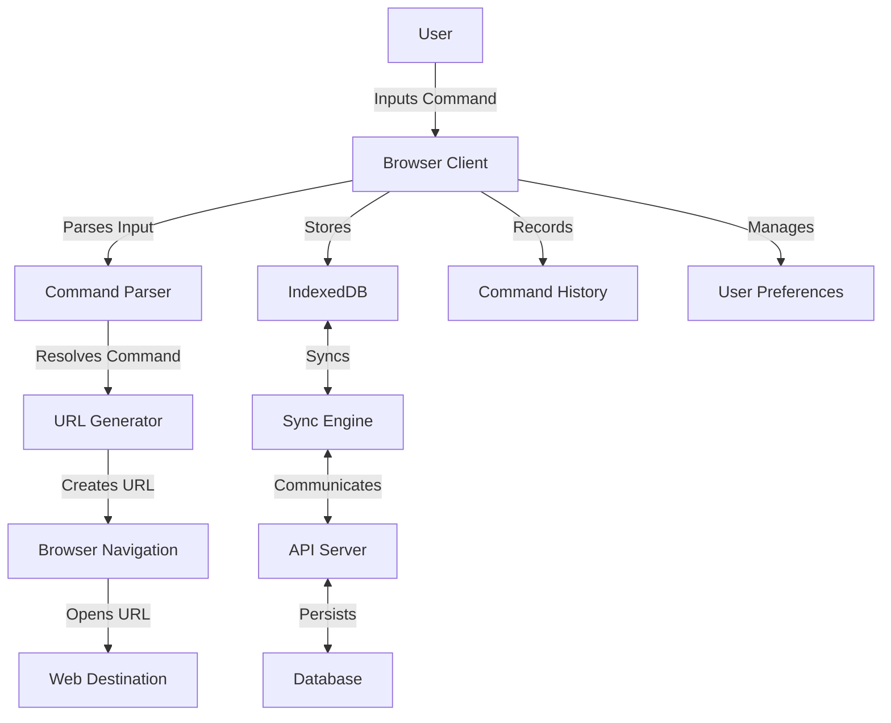
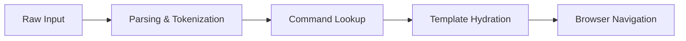
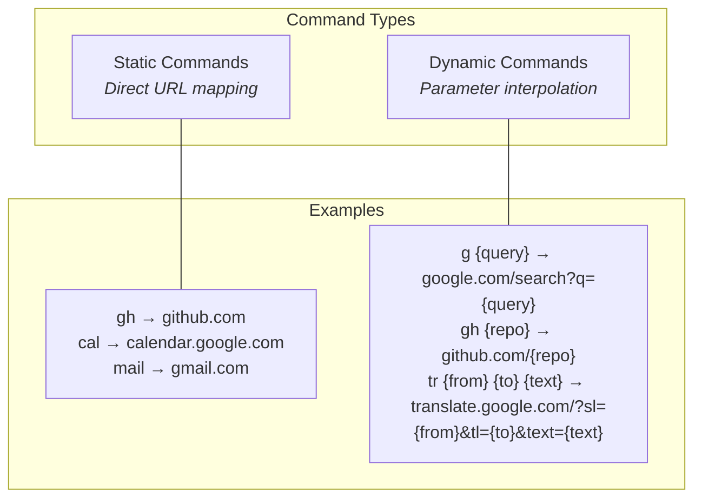
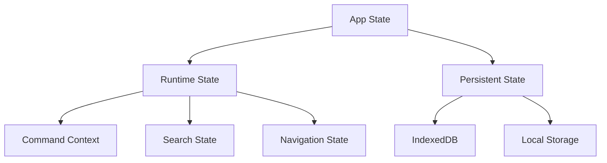
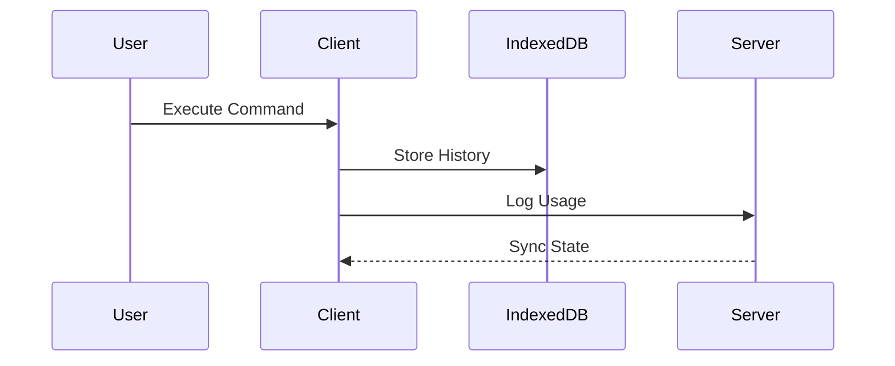
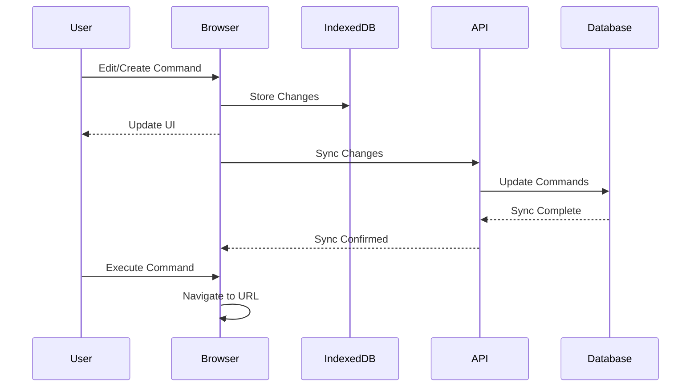
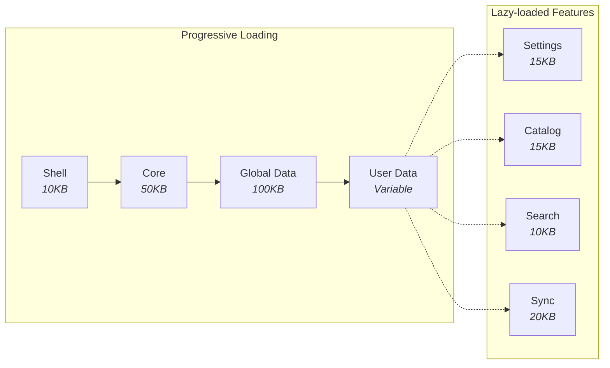
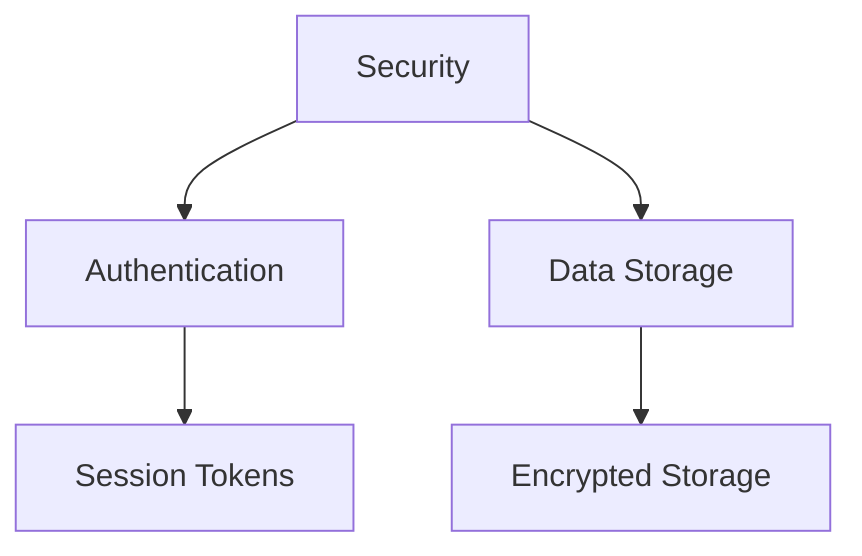

# Technical Architecture

## 1. System Overview

meows.space transforms text inputs into parameterized URLs through a local-first architecture. The system operates as a command multiplexer with URL routing and command history management, enabling offline command management and online URL resolution.

## 2. Core Architecture

### 2.1 Command System

The command system forms the core of meows.space, transforming user text inputs into parameterized URLs through a structured pipeline. It processes raw text commands, identifies command patterns, extracts parameters, and constructs destination URLs based on predefined templates. This system enables users to quickly navigate to web destinations using shorthand commands rather than typing full URLs.

#### Command Processing Pipeline

The pipeline processes commands through these stages:

1. **Input parsing and tokenization** - Breaks down raw input into tokens
2. **Command lookup and parameter extraction** - Matches tokens to commands
3. **URL template hydration** - Populates templates with parameters
4. **Browser navigation** - Performs the navigation operation

#### Command Types

The system supports two fundamental command types:

**Static Commands** provide direct URL mappings without parameters. They function as simple shortcuts to frequently visited websites. When a user enters a static command like `gh`, the system immediately navigates to the associated URL (`github.com`) without requiring additional input. These commands are ideal for quick access to common destinations.

**Dynamic Commands** incorporate parameters into URL templates. They accept one or more arguments that are interpolated into predefined URL patterns. For example, when a user enters `g cats`, the system recognizes `g` as the command and `cats` as the parameter, then constructs the URL `google.com/search?q=cats`. Dynamic commands can support multiple parameters with different positions in the URL template, enabling complex operations like translation services that require source language, target language, and text parameters.

#### Data Model

The system uses several interconnected data models that are fully documented in the [Data Models](../index.md#data-models) section. These models include:

- Command - For command definitions and parameter extraction
- Service - For visual representation and metadata
- Tag - For categorization and organization
- User Profile - For user account information
- User Preferences - For user settings and configurations
- Error Response - For standardized API error handling

For detailed information about each model, including properties, relationships, and usage patterns, please refer to the dedicated model documentation.

### 2.2 State Management

The state management system handles data persistence and retrieval across different storage layers. It maintains application state during runtime and across sessions.

#### State Architecture

The state architecture consists of two primary components: runtime state in memory and persistent state in IndexedDB. Runtime state provides fast access to frequently used data, while persistent state ensures data durability across sessions.

#### Runtime State (Memory)

Runtime state contains the active application context during a session:

- **Command context** maintains the currently active command and its parameters. This includes the command being edited or executed, along with any extracted parameters.
- **UI state** tracks the current interface configuration, including selected commands, active panels, search queries, and scroll positions.
- **Command history** keeps a record of recently executed commands in an LRU cache, enabling quick access to frequently used commands without database queries.
- **Search index** provides an in-memory structure for fast command lookup, using prefix-based searching and fuzzy matching algorithms.

#### Persistent State (IndexedDB)

Persistent state maintains durable data across browser sessions:

- **Command definitions** store all user-defined commands, including their URLs, parameters, and metadata. This forms the core of the user's command library.
- **User profiles** contain user information, including display name, email, and authentication details.
- **User preferences** store interface settings, default behaviors, and personalization options that persist across sessions.
- **Command history** maintains a comprehensive log of executed commands with timestamps and execution contexts.
- **Organization structure** stores the folder hierarchy, labels, and categorization system for commands.
- **Pending changes** queue modifications made while offline, ensuring they're synchronized when connectivity is restored.

### 2.3 Data Synchronization

#### Local-First Operations

The data synchronization system manages bidirectional data flow between client and server databases. It handles two primary processes:

**Command Management Synchronization** uses a transaction-based approach. When users modify commands, the system first applies changes to the local IndexedDB, then queues them for server synchronization. Each change is timestamped and assigned a unique transaction ID. When online, the system transmits these changes to the server in batches. For concurrent edits from multiple devices, the system applies last-writer-wins conflict resolution, with special handling for structural conflicts like command deletion followed by modification.

**Command Execution** records command usage statistics. When a user executes a command, the system logs this event locally and, when online, transmits usage data to the server for analytics. The browser handles the actual URL navigation after command processing.

#### System Flow

This diagram shows the data flow during command management and execution. Command edits are immediately stored in IndexedDB and reflected in the UI. When online, changes are synchronized with the server. For command execution, the browser constructs the URL and performs navigation directly.

## 3. Frontend Architecture

The frontend architecture implements a React-based single-page application with a focus on performance, offline capabilities, and responsive design.

### 3.1 Technical Implementation

The frontend is built using:

- **React** for component-based UI development
- **TypeScript** for type safety and developer experience
- **CSS Modules** for component-scoped styling
- **IndexedDB** for client-side storage
- **Service Workers** for offline capabilities

### 3.2 Component Architecture

The component architecture follows a hierarchical structure with:

- **Container Components**: Handle data fetching and state management
- **Presentational Components**: Focus on rendering UI elements
- **Hooks**: Encapsulate reusable logic and state management
- **Context Providers**: Manage global state and theme

### 3.3 State Management

Frontend state management uses a combination of:

- **React Context API** for global state (theme, user session)
- **Custom hooks** for component-specific state
- **IndexedDB wrapper** for persistent storage operations
- **Optimistic updates** for responsive UI during async operations

For detailed information about pages and components, see the [Pages](../index.md#pages) and [Components](../index.md#components) sections in the main documentation.

### 3.4 Loading & Performance

The application implements a sequential loading strategy to reduce initial load time. Through progressive loading and code splitting, the system loads critical functionality first while deferring non-essential features.

#### Progressive Loading Strategy

The application loads in a defined sequence:

1. **Shell (10KB)** loads first, containing the HTML structure, critical CSS, and minimal JavaScript for command input. This initial payload loads in approximately 200ms on standard connections, providing immediate access to the command input field.

2. **Core (50KB)** loads second, including the command parser, state management system, and primary UI components. This enables basic command execution while additional components continue loading.

3. **Global Data (100KB)** loads third, containing the public command catalog, default templates, and system configuration. This data is cached and shared across users, allowing non-authenticated users to access public commands.

4. **User Data (Variable Size)** loads last for authenticated users, including personal commands, preferences, history, and folder structure.

#### Performance Optimization Techniques

The application implements multiple optimization techniques:

**Code Splitting** divides the application into separate chunks that load on demand. Features like settings, command catalog, search functionality, and synchronization components load only when accessed, reducing initial load time.

**Virtual Rendering** for grids and lists renders only visible items, maintaining consistent performance with large command sets. This uses windowed rendering that creates DOM elements only for items in the viewport.

**Bundle Optimization** includes tree-shaking to remove unused code, module deduplication to reduce redundancy, and critical CSS extraction. The delivery pipeline uses Brotli compression, cache control with ETags, and content-based versioning.

**Data Prefetching** loads data before user interaction, such as prefetching command details on hover or loading the next page of results before reaching the current page end.

**Caching Strategy** uses multiple storage mechanisms:

- Browser cache for static assets
- IndexedDB for command data and user preferences
- Memory cache for frequently accessed data
- Service worker for offline functionality

## 4. Backend Architecture

### 4.1 API Implementation

The backend implements a REST API with endpoints for:

- Command storage and retrieval
- User authentication
- Cross-device synchronization

API endpoints use standard HTTP methods and return JSON responses with appropriate status codes. Authentication uses session tokens with configurable expiration.

### 4.2 Data Storage

Data is stored in two layers:

- IndexedDB for local client-side persistence
- PostgreSQL for server-side storage

The database schema mirrors the data models with tables for commands, users, and usage data. Indexes are implemented on frequently queried fields to optimize read performance.

### 4.3 Security Implementation

Authentication uses session-based tokens stored in HTTP-only cookies. User passwords are hashed using bcrypt with a work factor of 10. HTTPS is required for all API communications.
